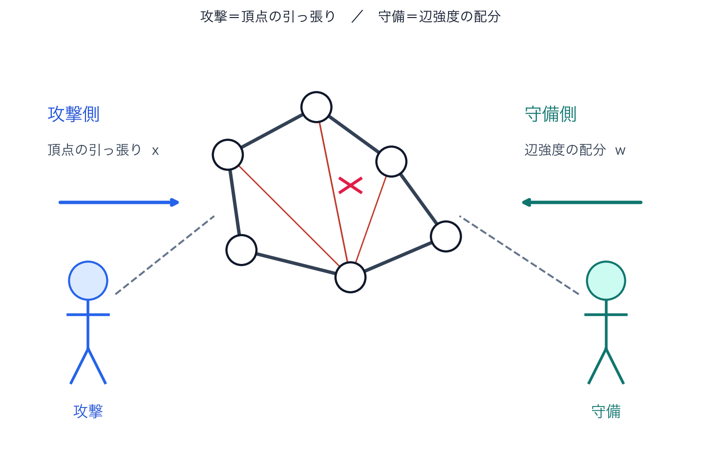
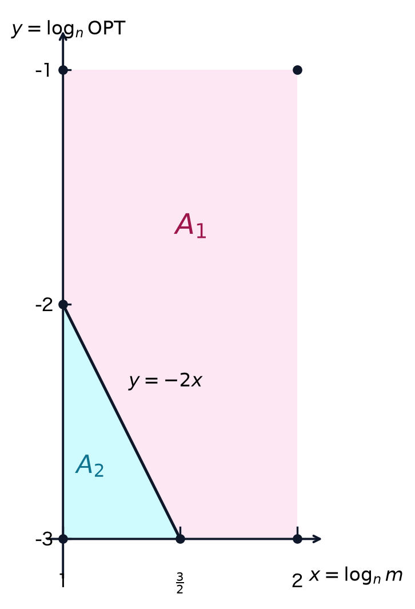

  <h1
    class="!text-2xl !leading-snug !text-left !text-black !font-normal"
    v-motion
    :initial="{ opacity: 0, x: -24 }"
    :enter="{ opacity: 1, x: 0, transition: { delay: 200, duration: 700 } }"
  >
    Multiplicative Weights Update 
    for Absolute Algebraic Connectivity
  </h1>

  

    布施 祐大郎, 清水 伸高
  

  

    東京科学大学
  

  

    夏のLAシンポジウム2026
  

---
layout: section
---

# 背景と動機

---

# ネットワーク設計

現実の多くのシステムは，ネットワークとして表現できる．

- 通信網：障害が起きても通信を維持したい．
- 交通網・物流網：一部の経路が止まっても全体機能を保ちたい．
- 分散システム：情報共有や合意形成を安定かつ高速に行いたい．

この共通課題は，「ネットワークをどれだけ頑健に設計できるか」である．

本研究ではあるグラフが与えられたときに，各辺に重みを配分し，その重み付きグラフの連結性を最大化する問題を考える．

---

# 問題の直感

構造が同じグラフでも，重み配分により「分断されにくさ」は大きく変化する．

  

    <svg viewBox="0 0 220 145" class="w-full max-w-sm mx-auto">
      <!-- left cluster -->
      <circle cx="40" cy="58" r="6" fill="#111"/>
      <circle cx="68" cy="28" r="6" fill="#111"/>
      <circle cx="78" cy="78" r="6" fill="#111"/>
      <line x1="40" y1="58" x2="68" y2="28" stroke="#ccc" stroke-width="2"/>
      <line x1="68" y1="28" x2="78" y2="78" stroke="#ccc" stroke-width="2"/>
      <line x1="78" y1="78" x2="40" y2="58" stroke="#ccc" stroke-width="2"/>
      <line x1="40" y1="58" x2="68" y2="28" stroke="#111" stroke-width="6"/>
      <!-- right cluster -->
      <circle cx="150" cy="58" r="6" fill="#111"/>
      <circle cx="178" cy="28" r="6" fill="#111"/>
      <circle cx="188" cy="78" r="6" fill="#111"/>
      <line x1="150" y1="58" x2="178" y2="28" stroke="#ccc" stroke-width="2"/>
      <line x1="178" y1="28" x2="188" y2="78" stroke="#ccc" stroke-width="2"/>
      <line x1="188" y1="78" x2="150" y2="58" stroke="#ccc" stroke-width="2"/>
      <line x1="150" y1="58" x2="178" y2="28" stroke="#111" stroke-width="6"/>
      <!-- thin bridge + cut -->
      <line x1="78" y1="78" x2="150" y2="58" stroke="#111" stroke-width="1.2"/>
      <line x1="105" y1="58" x2="123" y2="76" stroke="#E60012" stroke-width="2.5"/>
      <line x1="105" y1="76" x2="123" y2="58" stroke="#E60012" stroke-width="2.5"/>
      <text x="110" y="130" text-anchor="middle" font-size="16" fill="#333">悪い配分</text>
    </svg>
  

  

    <svg viewBox="0 0 220 145" class="w-full max-w-sm mx-auto">
      <circle cx="40" cy="58" r="6" fill="#111"/>
      <circle cx="68" cy="28" r="6" fill="#111"/>
      <circle cx="78" cy="78" r="6" fill="#111"/>
      <line x1="40" y1="58" x2="68" y2="28" stroke="#ccc" stroke-width="2"/>
      <line x1="68" y1="28" x2="78" y2="78" stroke="#ccc" stroke-width="2"/>
      <line x1="78" y1="78" x2="40" y2="58" stroke="#ccc" stroke-width="2"/>
      <circle cx="150" cy="58" r="6" fill="#111"/>
      <circle cx="178" cy="28" r="6" fill="#111"/>
      <circle cx="188" cy="78" r="6" fill="#111"/>
      <line x1="150" y1="58" x2="178" y2="28" stroke="#ccc" stroke-width="2"/>
      <line x1="178" y1="28" x2="188" y2="78" stroke="#ccc" stroke-width="2"/>
      <line x1="188" y1="78" x2="150" y2="58" stroke="#ccc" stroke-width="2"/>
      <!-- thick bridge -->
      <line x1="78" y1="78" x2="150" y2="58" stroke="#1C3177" stroke-width="7"/>
      <text x="110" y="130" text-anchor="middle" font-size="16" fill="#333">良い配分</text>
    </svg>
  

  太線：配分大
  細線：配分小

「分断されにくさ」を測り，その値を重み配分によって**最大化**できるか．

---

# 連結性指標 $\lambda_2$ とその解釈

重み付きラプラシアン $L(w)$ の第二固有値（algebraic connectivity）[Fiedler 1973]：

$$
\lambda_2(L(w))
= \min_{\substack{x^\top\mathbf{1}=0\\ \|x\|_2=1}}
\sum_{\{u,v\}\in E} w_{\{u,v\}}(x_u-x_v)^2
$$

  

  **ゲームとしてみる：**

  - **守備側**：総量1の強度を辺へ配分（$w\in\Delta_E$）
  - **攻撃側**：頂点の引っ張り $x$ を選ぶ 
    （$x^\top\mathbf{1}=0$，$\|x\|_2=1$）
  - 利得 $C(x;w)=\sum w_e(x_u-x_v)^2$（弾性エネルギー）
  - 攻撃側は $C$ を最小化し，$\lambda_2(L(w))=\min_x C(x;w)$

  

  

    
    

      攻撃＝頂点の引っ張り，守備＝辺強度の配分
    

  

---

# 具体例：パス上の攻撃と守備

パス $1$--$2$--$3$--$4$．攻撃：$x=\bigl(-\tfrac12,-\tfrac12,\tfrac12,\tfrac12\bigr)$．
伸びるのは辺 $\{2,3\}$ のみで，$C(x;w)=w_{23}$．

  

    
守備A：$\{2,3\}$ が細い

    
$w_{12}=w_{34}=0.45$，$w_{23}=0.10$

    <svg viewBox="0 0 280 80" class="w-full max-h-20 mx-auto">
      <circle cx="30" cy="48" r="13" fill="#fff" stroke="#111" stroke-width="1.5"/>
      <circle cx="100" cy="48" r="13" fill="#fff" stroke="#111" stroke-width="1.5"/>
      <circle cx="170" cy="48" r="13" fill="#fff" stroke="#111" stroke-width="1.5"/>
      <circle cx="240" cy="48" r="13" fill="#fff" stroke="#111" stroke-width="1.5"/>
      <text x="30" y="53" text-anchor="middle" font-size="13">1</text>
      <text x="100" y="53" text-anchor="middle" font-size="13">2</text>
      <text x="170" y="53" text-anchor="middle" font-size="13">3</text>
      <text x="240" y="53" text-anchor="middle" font-size="13">4</text>
      <line x1="43" y1="48" x2="87" y2="48" stroke="#111" stroke-width="5"/>
      <line x1="113" y1="48" x2="157" y2="48" stroke="#c0392b" stroke-width="1.2"/>
      <line x1="183" y1="48" x2="227" y2="48" stroke="#111" stroke-width="5"/>
      <path d="M55 18 L20 18" stroke="#2563eb" stroke-width="2" fill="none"/>
      <path d="M215 18 L250 18" stroke="#dc2626" stroke-width="2" fill="none"/>
      <text x="35" y="12" font-size="10" fill="#2563eb">左へ</text>
      <text x="230" y="12" font-size="10" fill="#dc2626">右へ</text>
    </svg>
    
$C=0.10$（攻撃側に有利）

  

  

    
守備B：$\{2,3\}$ が太い

    
$w_{12}=w_{34}=0.05$，$w_{23}=0.90$

    <svg viewBox="0 0 280 80" class="w-full max-h-20 mx-auto">
      <circle cx="30" cy="48" r="13" fill="#fff" stroke="#111" stroke-width="1.5"/>
      <circle cx="100" cy="48" r="13" fill="#fff" stroke="#111" stroke-width="1.5"/>
      <circle cx="170" cy="48" r="13" fill="#fff" stroke="#111" stroke-width="1.5"/>
      <circle cx="240" cy="48" r="13" fill="#fff" stroke="#111" stroke-width="1.5"/>
      <text x="30" y="53" text-anchor="middle" font-size="13">1</text>
      <text x="100" y="53" text-anchor="middle" font-size="13">2</text>
      <text x="170" y="53" text-anchor="middle" font-size="13">3</text>
      <text x="240" y="53" text-anchor="middle" font-size="13">4</text>
      <line x1="43" y1="48" x2="87" y2="48" stroke="#bbb" stroke-width="1.2"/>
      <line x1="113" y1="48" x2="157" y2="48" stroke="#c0392b" stroke-width="6"/>
      <line x1="183" y1="48" x2="227" y2="48" stroke="#bbb" stroke-width="1.2"/>
      <path d="M55 18 L20 18" stroke="#2563eb" stroke-width="2" fill="none"/>
      <path d="M215 18 L250 18" stroke="#dc2626" stroke-width="2" fill="none"/>
      <text x="35" y="12" font-size="10" fill="#2563eb">左へ</text>
      <text x="230" y="12" font-size="10" fill="#dc2626">右へ</text>
    </svg>
    
$C=0.90$（守備側に有利）

  

- 同じ引っ張りでも，$w_{23}$ の大きさでコストが大きく変わる．
- 守備側は，あらゆる攻撃に対してコストが高くなるよう $w$ を配分したい．

---

# 守備側の最適化

守備側は，攻撃側の最善（$\min_x$）を見越して $w$ を選ぶ：

$$
\max_{w\in\Delta_E}\ \lambda_2(L(w))
=\max_{w\in\Delta_E} \min_{\substack{x^\top\mathbf{1}=0\\ \|x\|_2=1}}
\sum_{\{u,v\}} w_{\{u,v\}}(x_u-x_v)^2
$$

  

    <svg viewBox="0 0 240 130" class="w-full max-w-xs mx-auto">
      <!-- left -->
      <circle cx="35" cy="55" r="7" fill="#111"/>
      <circle cx="65" cy="25" r="7" fill="#111"/>
      <circle cx="78" cy="75" r="7" fill="#111"/>
      <line x1="35" y1="55" x2="65" y2="25" stroke="#bbb" stroke-width="2"/>
      <line x1="65" y1="25" x2="78" y2="75" stroke="#bbb" stroke-width="2"/>
      <line x1="78" y1="75" x2="35" y2="55" stroke="#bbb" stroke-width="2"/>
      <!-- right -->
      <circle cx="165" cy="55" r="7" fill="#111"/>
      <circle cx="195" cy="25" r="7" fill="#111"/>
      <circle cx="208" cy="75" r="7" fill="#111"/>
      <line x1="165" y1="55" x2="195" y2="25" stroke="#bbb" stroke-width="2"/>
      <line x1="195" y1="25" x2="208" y2="75" stroke="#bbb" stroke-width="2"/>
      <line x1="208" y1="75" x2="165" y2="55" stroke="#bbb" stroke-width="2"/>
      <!-- thin bridge -->
      <line x1="78" y1="75" x2="165" y2="55" stroke="#E60012" stroke-width="1.5"/>
      <text x="120" y="115" text-anchor="middle" font-size="14" fill="#555">細い辺で接続</text>
      <text x="120" y="130" text-anchor="middle" font-size="13" fill="#E60012">攻撃側に有利</text>
    </svg>
  

  

    <svg viewBox="0 0 240 130" class="w-full max-w-xs mx-auto">
      <circle cx="35" cy="55" r="7" fill="#111"/>
      <circle cx="65" cy="25" r="7" fill="#111"/>
      <circle cx="78" cy="75" r="7" fill="#111"/>
      <line x1="35" y1="55" x2="65" y2="25" stroke="#bbb" stroke-width="2"/>
      <line x1="65" y1="25" x2="78" y2="75" stroke="#bbb" stroke-width="2"/>
      <line x1="78" y1="75" x2="35" y2="55" stroke="#bbb" stroke-width="2"/>
      <circle cx="165" cy="55" r="7" fill="#111"/>
      <circle cx="195" cy="25" r="7" fill="#111"/>
      <circle cx="208" cy="75" r="7" fill="#111"/>
      <line x1="165" y1="55" x2="195" y2="25" stroke="#bbb" stroke-width="2"/>
      <line x1="195" y1="25" x2="208" y2="75" stroke="#bbb" stroke-width="2"/>
      <line x1="208" y1="75" x2="165" y2="55" stroke="#bbb" stroke-width="2"/>
      <!-- thick bridge -->
      <line x1="78" y1="75" x2="165" y2="55" stroke="#1C3177" stroke-width="8"/>
      <text x="120" y="115" text-anchor="middle" font-size="14" fill="#555">太い辺で接続</text>
      <text x="120" y="130" text-anchor="middle" font-size="13" fill="#1C3177">守備側に有利</text>
    </svg>
  

- 戦略：攻撃されやすい辺の強度を高め，どの引っ張りでもコストが同程度になるようにする．
- これが algebraic connectivity の最大化問題である．

---

# 今回扱う問題

- グラフ構造は固定し，辺重みを変数として最適化する．
- 制約は「非負」かつ「総和1」：$w\in\Delta_E$．
- 目的は $\lambda_2(L(w))$ の最大化である．

**定義**（Absolute Algebraic Connectivity [Fiedler 1990]）

$$
\begin{aligned}
\text{maximize}\quad & \lambda_2(L(\boldsymbol{w})) \\
\text{subject to}\quad
& \boldsymbol{w} \in \Delta_E := \left\{\boldsymbol{x}\in\mathbb{R}_{\ge 0}^{E} \;\middle|\; \sum_{e\in E}x_e=1\right\}.
\end{aligned}
$$

この最適値を **absolute algebraic connectivity** という．

---

# この問題の難しさ

- 目的関数は固有値に基づく非平滑関数であり，解析・計算の両面で取り扱いが難しい．
- SDP定式化は可能であるが，実装負荷および計算負荷が高くなりやすい．
- 汎用ブラックボックス解法ではなく，グラフ構造を直接活用する解法が望まれる．

**本研究の目標**

一般グラフに対して，理論保証を伴う簡潔な組合せ的アルゴリズムを構築する．

---
layout: section
---

# 問題設定

---

# 準備：ラプラシアンとFiedlerベクトル

無向グラフ $G=(V,E)$ に対し，辺 $e=\{u,v\}$ の辺ラプラシアンを
$L_e := (\chi_u - \chi_v)(\chi_u - \chi_v)^\top$ と定める．

重み $w\in\Delta_E$ に対するラプラシアンは $L(w)=\sum_{e\in E} w_eL_e$ である．

- $L(w)$ の最小固有値は常に $0$（対応固有ベクトルは $\mathbf{1}$）．
- $X := \left\{x \in \mathbb{R}^n \mid x^\top \mathbf{1} = 0, \; \|x\|_2 = 1\right\}$ とおくと：

$$
\lambda_2(L(w)) = \min_{x\in X} x^\top L(w) x.
$$

この最小値を与える $x$ は $L(w)$ の第二固有ベクトルであり，**Fiedlerベクトル**と呼ばれる．

---

# 近似Fiedlerベクトル

正確なFiedlerベクトルの計算は難しいので，**近似Fiedlerベクトル**を用いる．

**定義**（近似Fiedlerベクトル [Spielman–Teng 2014]）

$x\in X$ が
$x^\top L x \le (1+\alpha)\lambda_2(L)$
を満たすとき，$x$ を $\alpha$-近似Fiedlerベクトルという．

**補題**（高速オラクル [Spielman–Teng 2014]）

任意の $\alpha>0$ に対し，確率 $1-\frac{1}{m^{10}}$ 以上で $\alpha$-近似Fiedlerベクトルを出力する
ランダム化アルゴリズムが存在し，計算時間は $\widetilde{O}\!\left(\frac{m}{\alpha}\right)$．

---

# 問題の定式化

本研究では，汎用SDPソルバーの代替として，MWUに基づく組合せ的アルゴリズムを提案する．

- **入力**：連結無向グラフ $G=(V,E)$（$n$ 頂点，$m$ 辺）と $\varepsilon>0$
- **出力**：次を満たす $\boldsymbol{w}\in\Delta_E$

$$
\lambda_2(L(\boldsymbol{w})) \ge (1-\varepsilon)\cdot \mathsf{OPT}
$$

（確率 $2/3$）．ただし $\mathsf{OPT}=\max_{w\in\Delta_E}\lambda_2(L(w))$．

また，$1/n^3\le \mathsf{OPT}\le 2/(n-1)$ が成り立つ．

---

# 主結果

**定理**（主定理）

任意の $\varepsilon>0$ に対し，$(1-\varepsilon)$-近似解を確率 $2/3$ で出力するアルゴリズム $A_1$ が存在する：

$$
\widetilde{O}\!\left(\frac{m}{\varepsilon^3\mathsf{OPT}}\right)
\quad\bigl(\varepsilon\text{ が定数なら }\widetilde{O}(m/\mathsf{OPT})\bigr).
$$

- 比較対象：Jiangら [2020] の切除平面法 **$A_2$** → $\widetilde{O}(m^3\mathrm{polylog}(1/\varepsilon))$
- $\mathsf{OPT}\gtrsim 1/m^2$ では $A_1$ が優位，$\mathsf{OPT}$ が小さい領域では $A_2$ が優位となり得る

---
layout: two-cols
layoutClass: gap-4
---

# 計算量の比較

- $(x,y)=(\log_n m,\log_n\mathsf{OPT})$ に応じて最速アルゴリズムが変化する．

**例：**

- **パス** $P_n$：
  $m=\Theta(n)$，$\mathsf{OPT}=\Theta(n^{-3})$
  → $A_2$ が高速
  （$\widetilde{O}(n^3)$ vs. $\widetilde{O}(n^4)$）

- **直径 $O(1)$**：
  $\mathsf{OPT}=\Omega(n^{-2})$ より
  $A_1$ は $\widetilde{O}(mn^2)$．
  密グラフ（$m=\Theta(n^2)$）では $A_1$ が優位．

::right::

  
  

    $A_1$（ピンク）と $A_2$（シアン）の優位領域
  

---
layout: section
---

# アルゴリズム：MWU

---

# 変分的な見方

Absolute Algebraic Connectivity は次の鞍点問題として表される：

$$
\mathsf{OPT}
= \max_{\boldsymbol{w} \in \Delta_E} \min_{\boldsymbol{x}\in X} \boldsymbol{x}^\top L(\boldsymbol{w}) \boldsymbol{x}
$$

- $\boldsymbol{x}^\top L(\boldsymbol{w})\boldsymbol{x} = \sum_{e=\{u,v\}} w_e (x_u-x_v)^2$
- 各辺の利得は $(x_u-x_v)^2$ で評価される
- この構造に合わせて **MWU** を適用する [Arora–Hazan–Kale 2012]

---

# アルゴリズム $A_1$：近似Fiedlerオラクル付きMWU

**更新則**

1. 初期化：$w_e^{(0)}=1/m$（一様），学習率 $\eta$，近似度 $\alpha$，反復回数 $T$．
2. 各時刻 $t=0,\dots,T-1$ について：
   1. $L(w^{(t)})$ の $\alpha$-近似Fiedlerベクトル $x^{(t)}$ を求める．
   2. 損失 $\ell_t(e):=(x_u^{(t)}-x_v^{(t)})^2/4$（$0\le\ell_t(e)\le1$）．
   3. 乗法的更新：$w_e^{(t+1)} \propto w_e^{(t)}\exp\bigl(\eta\,\ell_t(e)\bigr)$．
3. 出力は平均 $\bar{w} = \frac{1}{T}\sum_{t=0}^{T-1}w^{(t)}$．

---

# 解析：local norm technique による改善

通常のMWUのリグレット解析では，必要な反復回数は $O(1/\mathsf{OPT}^2)$ である．

**local norm technique** [SS2011]

反復回数を $O(1/\mathsf{OPT})$ まで減らせる．
定数 $\varepsilon$ のもとでは $\widetilde{O}(m/\mathsf{OPT})$ が得られる．

**補題**（リグレットバウンド・概略）

$0<\eta\le1/2$ のとき，任意の $u\in\Delta_E$ に対して

$$
\sum_{t=0}^{T-1}\langle w^{(t)},\ell_t\rangle
\ge (1-\eta)\sum_{t=0}^{T-1}\langle u,\ell_t\rangle - \tfrac{\log m}{\eta}.
$$

とくに $u=w^\star$ とおくと，$\langle w^\star,\ell_t\rangle\ge\mathsf{OPT}/4$．

---

# 近似保証

**補題**

出力 $\bar{w}$ は確率 $1-T/m^{10}$ 以上で

$$
\lambda_2(L(\bar{w}))
\ge
\frac{(1-\eta)\mathsf{OPT}-4\log m/(\eta T)}{1+\alpha}
$$

を満たす．1反復あたり $\widetilde{O}(m/\alpha)$．

パラメータ例（下界 $\gamma\le\mathsf{OPT}$ が既知）：

$$
\alpha=\eta=\varepsilon/4,\qquad
T=\Bigl\lceil\frac{64\log m}{\varepsilon^2\gamma}\Bigr\rceil
\;\Longrightarrow\;
\lambda_2(L(\bar{w}))\ge (1-\varepsilon)\mathsf{OPT}.
$$

---

# 未知の $\mathsf{OPT}$：Doubling Trick

学習率と反復回数は未知の $\mathsf{OPT}$ に依存する．
そこで **Doubling Trick** により，下界 $\gamma$ を段階的に推定する．

**手順**

- 既知の範囲：$1/n^3\le \mathsf{OPT}\le 2/(n-1)$
- $\gamma_0=2/(n-1)$ から始め，
  $\gamma\in\bigl\{\gamma_0,(1+\varepsilon/2)^{-1}\gamma_0,\ldots\bigr\}$
  を順に試し，条件を満たした最初の出力を返す

- 成功する最小の推定値は $\Theta(\mathsf{OPT})$．失敗試行のコストは等比級数に収まる
- 全体の計算量は $\widetilde{O}(m/(\varepsilon^3\mathsf{OPT}))$（定数 $\varepsilon$ では $\widetilde{O}(m/\mathsf{OPT})$）

---

# まとめ

- absolute algebraic connectivity に対し，汎用SDPを用いず，組合せ的な近似アルゴリズムを与えた．
- MWU・近似Fiedlerオラクル・local norm technique を組み合わせ，定数 $\varepsilon$ のもとで $\widetilde{O}(m/\mathsf{OPT})$ を達成した．
- $\mathsf{OPT}$ が比較的大きい場合（例：直径 $O(1)$ の密グラフ）には，$A_2$ より有利になり得る．

---
layout: center
class: text-center
---

# 参考文献

1. M. Fiedler. Algebraic connectivity of graphs. *Czechoslovak Math. J.*, 1973.
2. M. Fiedler. Absolute algebraic connectivity of trees. *Linear Multilinear Algebra*, 1990.
3. D. A. Spielman and S.-H. Teng. Nearly linear time algorithms for preconditioning and solving symmetric, diagonally dominant linear systems. *SIAM J. Matrix Anal. Appl.*, 2014.
4. S. Arora, E. Hazan, and S. Kale. The multiplicative weights update method: a meta-algorithm and applications. *Theory of Computing*, 2012.
5. H. Jiang, Y. T. Lee, Z. Song, and S. C.-W. Wong. An improved cutting plane method for convex optimization, convex-concave games, and its applications. *STOC*, 2020.

